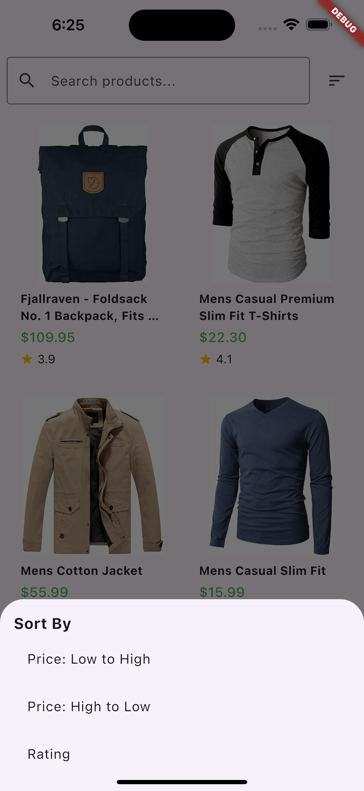
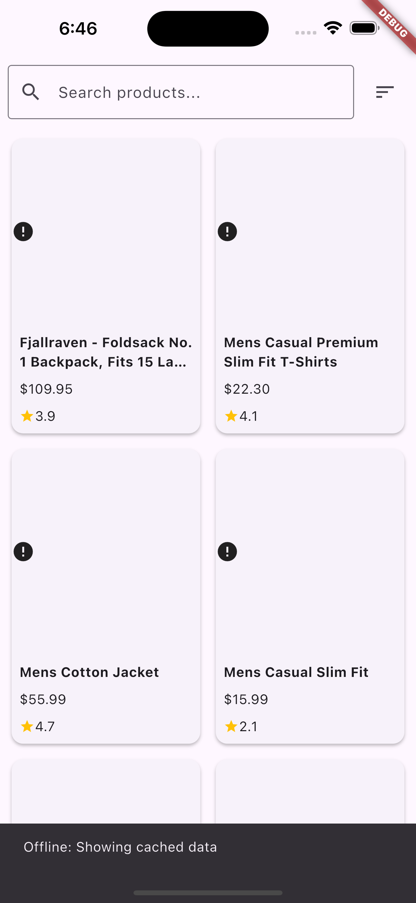

# Qtec Task - E-Commerce Product Listing App

## Overview
This is a Flutter application developed as part of the Qtec Task for a job application. The app is an e-commerce product listing platform that fetches products from the FakeStoreAPI, supports pagination, search, sorting, and offline caching. It follows Clean Architecture and uses BLoC for state management.

### Features
- **Product Listing**: Fetches products from FakeStoreAPI with simulated pagination (10 products per page).
- **Search**: Filter products by name using a search bar.
- **Sorting**: Sort products by Price (Low to High, High to Low) and Rating via a bottom modal sheet.
- **Offline Support**: Caches products using Hive and displays cached data when offline with a snackbar notification.
- **State Management**: Uses BLoC pattern for robust state management and minimal widget rebuilds.
- **Testing**: Includes a widget test for `ProductCard` and a unit test for `GetProducts` use case.
- **Clean Architecture**: Separates code into presentation, domain, and data layers for maintainability.

### Screenshots
*Home Page with Products*


*Search Functionality*


*Sorting Bottom Sheet*


*Offline Snackbar*


## Setup Instructions
1. **Clone the Repository**:
   ```bash
   git clone https://github.com/Navid-Rahman/qtec_ecommerce_product_app.git
   cd qtec-task